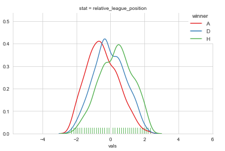
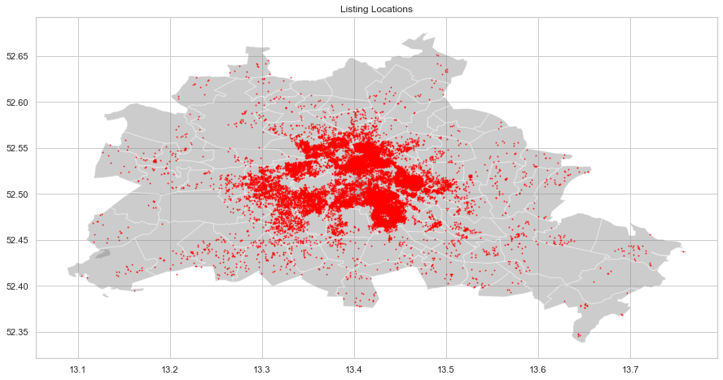
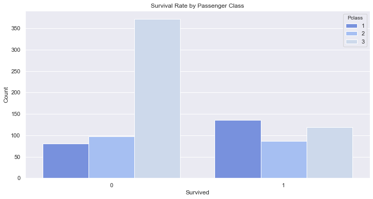

My name is Nick Hill, I am a First Class MSci Mathematics graduate from the University of Birmingham. Currently working remotely as a Software Developer for a tech start-up company in Bristol.

Over the past year I have developed my data science skills by completing online courses and building a portfolio of work. I have produced summaries of the projects I have completed to highlight some key aspects of each project. 

Further information about my education and experience can be found on my [LinkedIn profile.](https://www.linkedin.com/in/nicholas-hill-a74722145/)

More detailed reports and the code from each project are available in the GitHub repositories, which can be accessed by using the links.

# [Football Result Prediction Project Overview](https://github.com/nickhill97/football_predictions)

The purpose of this project was to use machine learning to predict premier league results. This could have many uses, for example, betting or management of a premier league team. The best model that I trained to solve this problem was a logistic regression model that predicted whether a team would win or not, this had an accuracy of 0.69.

- Collected the premier league fixtures data from the last 10 years from an API endpoint using a Python script.
- Calculated statistics that were correct at the time the games were played.
- Used a custom function to create interaction terms and relative statistics between the two teams.
- Used a weighted F1 statistic and GridSearchCV to find the best model and optimise the parameters.

  
  
# [Berlin AirBnb](https://github.com/nickhill97/berlin_airbnb)

The purpose of this project was to create a model that predicts the price a listing on AirBnb in Berlin based on features of the listing. The potential of a model like this could be to help a new host set the price of their listing. The goal would be to create a resource that airbnb hosts could input the information of their property and the model would predict how much the property should be placed on airbnb for. The final model has a mean absolute error of $17.17.

- Used different approaches to dealing with skewed data and outliers.
- Calculated the absolute distance from popular tourist spots using latitude and longitude coordinates.
- Used random forest feature importance to perform feature selection.
- Used GridSearchCV to tune the parameters in the final model.

  
  
# [Titanic Project Overview](https://github.com/nickhill97/titanic)
  
  
In this project I attempted the titanic competition on kaggle.com, the data was collected from the kaggle website in CSV form. The final model had an accuracy of 0.78947 on the test set.

The data was already split into a training and test set, where the test set did not disclose the target variable. The goal of the competition is to produce the best model to predict whether a passenger on the titanic survived or died based on the features. Some of the key parts of this project:

- Filled missing age values using a linear lasso regression model.
- Created title feature from the name using python regular expressions.
- Performed recursive feature elimination to find an optimal subset of features to train the model on.
- Used K fold cross validation to estimate the accuracy of the models.
- The best model was a SVC with mean accuracy of 0.834 from the K fold cross validation models.

